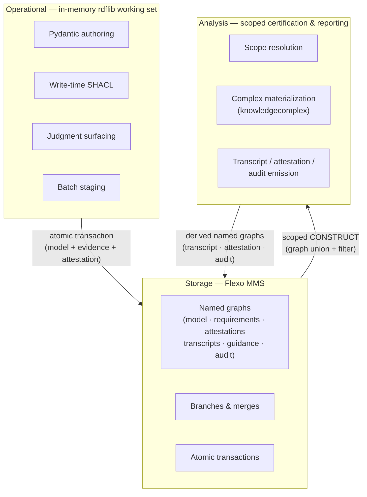

<!-- SPDX-License-Identifier: CC-BY-4.0 -->
# Three-Layer Architecture

`flexo-rtm` splits the system into three layers — **Operational**, **Storage**, and **Analysis** — each with a distinct latency budget, a distinct authority class, and a distinct interface contract. The layers are stacked but not interchangeable: collapsing any pair of them produces a system that either feels too slow to use or cannot make defensible certification claims. This page is the orientation reference; the layer-specific pages cover each surface in depth (see [[Operational Layer UX Discipline]], [[Storage Layer Flexo Conventions]], [[Analysis Layer Scope Algebra]]).

The canonical statement of the architecture lives in [[Design Spec]] §5; this page summarizes the rationale and boundaries.

## The three layers

### Operational

A fast, in-memory, model-state-induced surface. The working-set is an `rdflib` dataset materializing only the slice of the certification complex that is currently checked out — typically hundreds of triples, not millions. Authoring happens through Pydantic models with **write-time SHACL** on every keystroke-equivalent edit. The skill and CLI operate against this layer exclusively. The whole point of the operational layer is that it must feel **weightless**: judgment surfacing, validation-edge creation, deferred-judgment markers, and batch staging all happen here without ever paying network round-trip latency to the authoritative store.

### Storage

Flexo MMS — the authoritative, persistent, versioned quadstore. Triples live in fixed-partition named graphs (model, requirements, attestations, transcripts, guidance, audit). Branches isolate concurrent engineering streams. Every commit is an atomic transaction tagged with a single `prov:Activity` IRI and the active `rtm:Scope` IRI that was in effect during authoring. Conflict resolution is constraint-aware: verification-scope merges run through SHACL/SPARQL ASK and resolve automatically; validation-scope merges escalate to named human approvers. Storage is the only layer that **persists authority**; everything else either prepares writes for it or reads scoped projections out of it.

### Analysis

A read-mostly surface for certification, reporting, and topological analysis. Its input is an `rtm:Scope` IRI, which resolves to a named-graph union plus optional SPARQL filters; its output is a **canonical input** to whichever analysis is being run (coverage report, adequacy/sufficiency assessment, TDA pipeline, audit roll-up). When a complex is required, `knowledgecomplex` materializes it on demand — analysis pays the materialization cost, the operational layer never does. Results write **back** to storage as derived named graphs (transcript, attestation, audit), preserving the chain from input scope through analysis activity to emitted artifact.

## Why three, not two

The obvious design — and the one most quadstore-backed tooling settles on — collapses operational and storage into a single layer: every edit is a transaction against the authoritative store, every read goes back to the wire. That collapse is fatal for `flexo-rtm` because **UX latency = adoption**. The skill prompts engineers at judgment moments; if SHACL gating, scope projection, and judgment surfacing all run against Flexo over the network on every keystroke, the authoring loop is too slow to use. Engineers fall back to spreadsheets and the certification artifact never gets built.

So we pay the cost of a separate operational layer: an in-memory working set with its own SHACL validators, its own model state, and its own commit semantics. The cost is real — we maintain a serialization boundary and a batch-commit discipline — but it buys the only thing that matters at the human interface: **the authoring loop feels local, because it is local**.

The split between storage and analysis is the second non-collapse. Analysis is read-heavy, expensive (complex materialization can be combinatorial), and produces large derived artifacts. Mixing analysis writes into the authoring transaction stream would either slow authoring or pollute the authoritative graph with intermediate results. Instead, analysis runs on scoped projections, materializes complexes opt-in, and writes results to dedicated derived named graphs — analyzable, comparable across baselines, but never in the authoring path.

## Data flow

The diagram shows three crossings, all of them deliberate.

## Layer responsibilities

**Operational** owns the working set, write-time SHACL, judgment surfacing, deferred-judgment markers, and the batch-commit envelope. It is the only layer that talks to a human.

**Storage** owns persistent authority, named-graph partitioning, branch/merge policy, conflict resolution, atomic transactions, per-commit provenance integrity, and per-commit scope metadata. It is the only layer that decides what is *officially* in the model.

**Analysis** owns scope resolution, complex materialization, canonical-input construction, certification artifact emission (transcripts, attestations, audit reports), and write-back of derived graphs. It is the only layer that produces certification claims.

## Layer boundaries — what crosses

The three layers communicate through three well-defined boundary protocols, and only these:

- **Operational → Storage** — atomic transaction. A `flexo-rtm commit` lands model triples, evidence references, and attestation triples *together* in a single Flexo transaction; partial commits are forbidden. Every triple in the commit shares one `prov:Activity` IRI and the commit records the active `rtm:Scope` IRI. Model evolution and traceability evolution always version together. See [[Storage Layer Flexo Conventions]] for the F1–F7 interface contract.

- **Storage → Analysis** — scoped CONSTRUCT. Analysis never reads the full quadstore; it reads through an `rtm:Scope` IRI that resolves to a graph union (and optional `FILTER` clause) and CONSTRUCTs the canonical input. Scopes are themselves first-class RDF resources, composable by union / intersection / extension. See [[Analysis Layer Scope Algebra]].

- **Analysis → Storage** — derived named-graph write. Analysis results are written back to dedicated named graphs (`transcript`, `attestation`, `audit`) so that future analyses, comparisons across baselines, and reproducibility runs can re-read the chain from input scope through emitted artifact.

Three flows. No other crossings. In particular: the operational layer never reads from the analysis layer, and the analysis layer never reads from the operational layer.

## Dependency direction

- **Analysis depends on Storage** (it reads scoped projections; it writes back derived graphs).
- **Operational depends on Storage** (it commits atomically; it pulls working-set materializations on checkout).
- **Operational and Analysis are independent** — they share no code path and no runtime dependency. The operational layer authors; the analysis layer certifies; both meet through storage.

This independence is what lets the operational layer stay fast: nothing in the authoring loop calls into analysis, so nothing in the authoring loop can be slowed down by it.

## Why this is unusual for an RDF tool

Most quadstore-backed RDF tooling collapses operational and storage into one layer — the user types, the store records, and validation runs against the authoritative graph. That works fine when edits are infrequent or batch-oriented (e.g., bulk ingest, schema-driven ETL). It fails for engineering-authoring workflows where edits are frequent, granular, and judgment-laden, and where the SHACL surface is wide enough that every-keystroke validation against a real network store is unaffordable.

`flexo-rtm` separates them because the operational UX requires speeds the network cannot deliver. The cost is a serialization boundary and a batch-commit discipline; the reward is that the authoring surface stays local, fast, and judgment-friendly, while the authoritative store stays where it must be — versioned, branched, audited, and shared.

## See also

- [[Design Spec]] §5 — canonical statement with ASCII diagram
- [[Operational Layer UX Discipline]]
- [[Storage Layer Flexo Conventions]]
- [[Analysis Layer Scope Algebra]]
