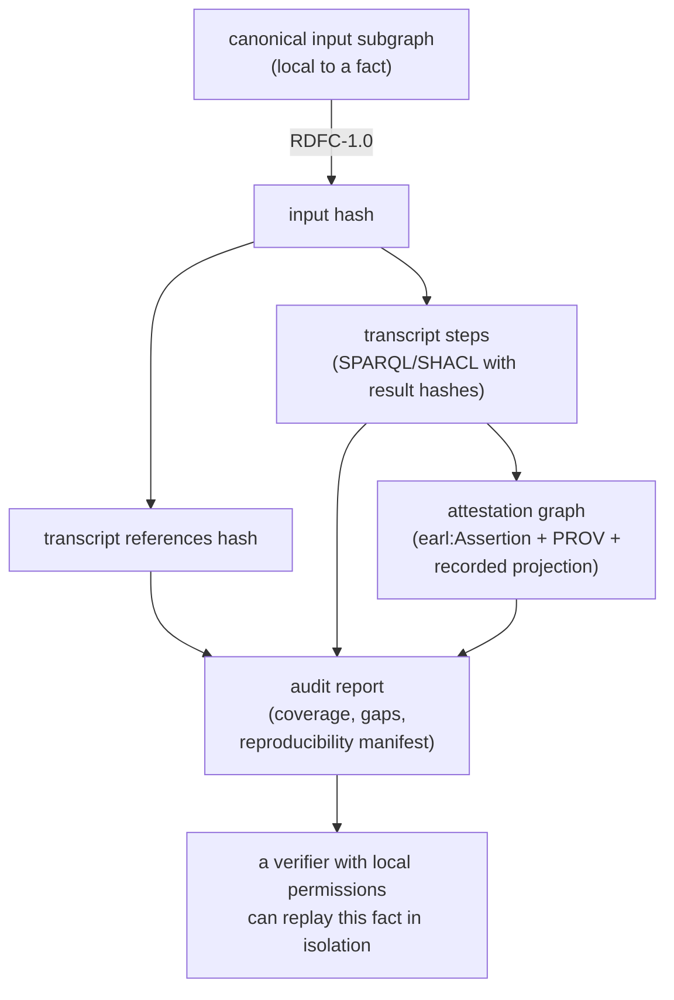

<!-- SPDX-License-Identifier: CC-BY-4.0 -->

# Verifiable Self-Certification

> Elaborates [[Design Spec]] §4.8 (three-layer artifact) and §4.9 (reproducibility chain). The cross-cutting acceptance criteria X1, X2, X6, X7, X8 in §9.A.5 are normative for this page.

**Verifiable self-certification** is the core concept of `flexo-rtm`. The name compresses two independent claims:

- *Verifiable* — any party with appropriate local permissions can independently re-execute the certification computation and arrive at byte-identical results. Certification does not rest on trust in the certifier; it rests on the certifier publishing enough structural information that the result is reproducible.
- *Self-certification* — the party that owns the model and evidence is the same party that produces the certification. No external authority issues the certificate; the certifying agent attests under the names of accountable humans, and the artifact records the attestation chain rather than embedding it inside a sealed certificate from a third party.

This is deliberately not the same shape as:

- **Third-party certification** (a CB or notified body inspects and grants a certificate). `flexo-rtm` does not preclude this, but the certification act is performed by the owner of the model.
- **Audit-on-demand** (the auditor re-derives the result from raw inputs each time). Verifiable self-certification persists the derivation as the artifact; re-derivation compares hashes rather than re-running judgment.
- **Signed-attestation-only** (a signed claim with no replayable computation behind it). The signature is necessary but not sufficient; the transcript is what makes the claim verifiable rather than merely authenticated.

The remainder of this page decomposes each half of the term into three components, then states the locality / federation principle that makes the result usable in multi-party institutional audits.

## Three components of *verifiability*

### 1. Deterministic computation

Every step in the certification is a SPARQL query or a SHACL shape evaluation, executed under a deterministic regime: solution ordering is canonical, shape evaluation order is recorded, and engines (pyshacl, rdflib SPARQL) run with deterministic options. There is no use of clocks, random seeds, network calls, or external state inside the computation itself — external URIs are dereferenced *out of band* into hashed, immutable inputs, and only the hashes flow into the computation. This is acceptance criterion X1 in [[Design Spec]] §9.A.5.

### 2. Canonical inputs

RDF allows the same graph to be serialized in many byte-different ways (blank node labels, prefix declarations, triple order). Verifiability requires that "the same input" mean exactly one thing. The oracle uses **RDFC-1.0 canonicalization** (W3C RDF Dataset Canonicalization) to normalize the input, then takes SHA-256 over that canonical serialization. This input hash is the load-bearing identity of "what was certified." Two parties holding the same RDF graph — independent of serialization choice — compute identical input hashes. See [[RDFC-1.0 Canonicalization]].

### 3. Replayable transcript

Each query and shape executed is logged as a `prov:Activity` with the IRI of the SPARQL query or SHACL shape (content-addressed), the canonical input hash, the canonical result hash, and a `prov:wasInformedBy` linkage to the step that produced its inputs. A verifier with the canonical input and the transcript can re-execute each step in order, compute their own result hash, and compare. If every step matches, the transcript replays; if any step mismatches, the verifier knows exactly where the divergence began. This is acceptance criterion X2. See [[Transcript Replay Semantics]].

These three components — deterministic computation, canonical inputs, replayable transcript — are jointly sufficient: anyone with read access to the canonical input subgraph and the transcript can re-derive the result independently.

## Three components of *self-certification*

### 1. The certifying agent attests to the model and evidence

The party operating `flexo-rtm` is the same party that owns the SysMLv2 model and the supporting evidence. The oracle runs in their environment, against their data, and the resulting cert artifact is published by them. No external certifying body sits between the engineer and the cert artifact. The trust mechanism is not an inspector's signature on a sealed certificate; it is the structural reproducibility of every step the certifier performed.

### 2. Named human accountability

Self-certification without named accountability would degrade into machine self-assertion. `flexo-rtm` requires that every attestation — satisfaction, adequacy, sufficiency — carry an `rtm:approvedBy` IRI pointing at a specific human identity, projected from the adopter's institutional identity provider (see [[Identity Boundaries and Policy Projections]]). The IRI is bound to a GPG/SSH-signed git commit at the moment the attestation is written, so "this person, at this time, attested this claim" is verifiable via standard public-key infrastructure. See [[Approver Binding via Git]].

SHACL gates this binding at write time. An attestation without an approver IRI is structurally impossible. This is the "by construction" mechanism in [[Mission and Thesis]]: accountability is not a post-hoc audit check, it is a precondition for the data existing at all.

### 3. The artifact *is* the certification

There is no separate certificate document. The audit-graph plus transcript plus attestation graph — the three-layer artifact described below — *is* the certification. It carries the input hashes, the step hashes, the attestations with named approvers, the external URI references, and the audit report's coverage statistics and gap enumeration. A third party who wants "the certificate" is handed the artifact and an entry point IRI; the artifact admits independent re-derivation of every answer it carries, which a conventional certificate would not. See [[Certification Predicate]] for how PASS/FAIL is defined as a predicate over the artifact rather than a verdict stamped onto it.

## The reproducibility principle: structural and local, not global

Per locked decision D26 (ADR-025) and [[Design Spec]] §4.9, reproducibility is **structural and local**, not global. This is what makes `flexo-rtm` cert artifacts usable in multi-party institutional audits. It has three pillars.

### Structural completeness

Each fact in the cert artifact is **structurally complete for its own local context**: the RDF neighborhood of the fact, the external URIs it references, the projection-at-cert-time of the identity / policy slice it depends on, and the signatures attached to it are all present in the artifact and sufficient to reproduce *that fact* in isolation. The artifact does not assume a verifier will have access to the rest of the graph; each fact carries its own locality.

Structural completeness is checkable without dereferencing — a verifier can confirm that every external URI is well-formed, every approver IRI resolves within the projection, every signature has the metadata needed to verify it, and every policy referenced is present — by reading the RDF alone. This is acceptance criterion X8.

### Locality

Verification of a single fact requires only access to that fact's **local neighborhood** plus the external URIs it references. There is no requirement to re-dereference the whole graph, and no requirement that a verifier hold universal permissions. A verifier with safety-aspect permissions verifies safety-aspect facts. A verifier with structural-only access verifies structural integrity. Each verification is a local operation against a local slice. This is acceptance criterion X6.

### Federation

Reproduction **composes across parties**. Federation has two axes:

- **Computational federation**: different parties run different fact-subsets. Each computes hashes for their slice; the union of slices covers the artifact.
- **Organizational federation**: different parties hold different permission slices — safety, design, regulator-structural-only — each reviews what they are entitled to see. The union of their per-fact PASS results equals a global PASS over the union of their permission subsets. This is acceptance criterion X7.

This is what makes the cert usable in real institutional audits where the auditing parties have asymmetric access rights. Conventional certification breaks down here because the certificate is monolithic. The three-layer artifact carries enough locality that partial-permission audits compose to a complete audit without any single party seeing the whole.

## The three-layer artifact

The artifact has three layers, each contributing to locality of reproduction. See [[Three-Layer Architecture]] and [[Design Spec]] §4.8.

- **Transcript** — the deterministic SPARQL+SHACL execution log. One `prov:Activity` per step; input/result hashes per step; references to external URIs (git commits, content hashes, OCI digests — see [[External URI References]]). The load-bearing replayable primitive.
- **Attestation graph** — a named graph of `rtm:Attestation` records bound to `rtm:satisfies` triples. Each attestation carries a mandatory `rtm:approvedBy` IRI, PROV provenance, and (when the relevant profile is active) a signed envelope per [[Signed Envelopes and Established Standards]]. Each attestation is independently verifiable against the projection it references.
- **Audit report** — forward / backward coverage tables, T1–T8 gap enumeration, certification grade (PASS/FAIL per [[Certification Predicate]]), transcript IRI, attestation graph IRI, and a **reproducibility manifest** enumerating every external URI the cert depends on. Generated from the other two layers and itself replayable from them.

The layers compose: the audit report references the attestation graph, which references the transcript, which references the canonical inputs. Each layer is independently checkable; each fact in each layer carries the references needed to reproduce it locally.

## Verifiability chain

The diagram shows the chain for a *single fact*. The full artifact is a union of such chains, one per fact, each independently replayable. Locality lives in the bottom edge: a verifier holding permissions only for this fact's neighborhood can traverse the chain end-to-end without seeing any other fact.

## Federated verification scenarios

Four scenarios illustrate how the locality principle plays out. Each stands on its own as a local audit; the union composes to a complete federated audit.

- **Engineer self-certifies a subsystem.** The engineer who authored a subsystem model and gathered its evidence runs `flexo-rtm` against their slice; the resulting attestation lands in the cert artifact as the leaf-level claim. The engineer's GPG/SSH-signed commit binds their identity to the attestation.
- **Safety reviewer re-verifies safety-aspect facts.** A reviewer holding safety-aspect permissions reads the safety-aspect subgraph, dereferences the safety-aspect external URIs they are permitted to see, replays the transcript steps that produced safety-aspect attestations, and confirms result-hash equality. They never see confidential-design payloads.
- **External regulator verifies structural integrity.** A regulator with structural-only access reads the RDF, confirms every reference is present, every signature is well-formed, every projection is complete, every URI is in the reproducibility manifest — without dereferencing classified content. Per X8, this structural audit is complete on its own terms.
- **Sister-organization reproduction team.** A peer organization runs the recorded activities (per the external URIs — git commits, OCI digests) in their own environment, hashes the outputs, and compares to the recorded artifact hashes. They do not need access to the original cert's compute infrastructure; the activity definitions are content-addressed and the underlying tools are standard.

No party requires universal access for the audit to be complete.

## What this *does not* do

Verifiable self-certification does not validate the engineering judgment itself. Whether a piece of evidence is *actually adequate* to satisfy a requirement is a human-judgment call, captured in the named-approver attestation. The certification machinery does not re-judge that; it ensures:

- the structure of the attestation chain is sound (every claim has the references it needs),
- the computations the chain depends on are reproducible (every step replays byte-identically),
- the named human accountability is genuine (every approver is bound to a signed commit at attestation time).

Engineering judgment is what `flexo-rtm` surfaces and captures; it is not what `flexo-rtm` automates.

## Relationship to V&V

`flexo-rtm` keeps verification and validation distinct in the artifact:

- **Verification** is automated and produced by the oracle. It is the replayable computation: did the SPARQL queries run, did the SHACL shapes pass, are the structural invariants present, are the references complete? Verification is reproducible by anyone with the relevant local access.
- **Validation** is human-attested and bound to named approvers. It is the judgment claim: this evidence is adequate, this artifact satisfies the requirement, this evidence is sufficient. Validation is captured in the attestation graph with `rtm:approvedBy` bindings.

A verifier can confirm the verification layer by replaying the transcript; the validation layer requires reading the attestations and trusting the named humans (or escalating to them, via the public-key binding, if the claim is challenged). The split is what lets the same artifact serve both automated tooling and institutional review.

---

See also: [[Three-Layer Architecture]], [[RDFC-1.0 Canonicalization]], [[Transcript Replay Semantics]], [[Approver Binding via Git]], [[Mission and Thesis]], [[Certification Predicate]], [[External URI References]], [[Identity Boundaries and Policy Projections]], [[Signed Envelopes and Established Standards]], [[Design Spec]].
